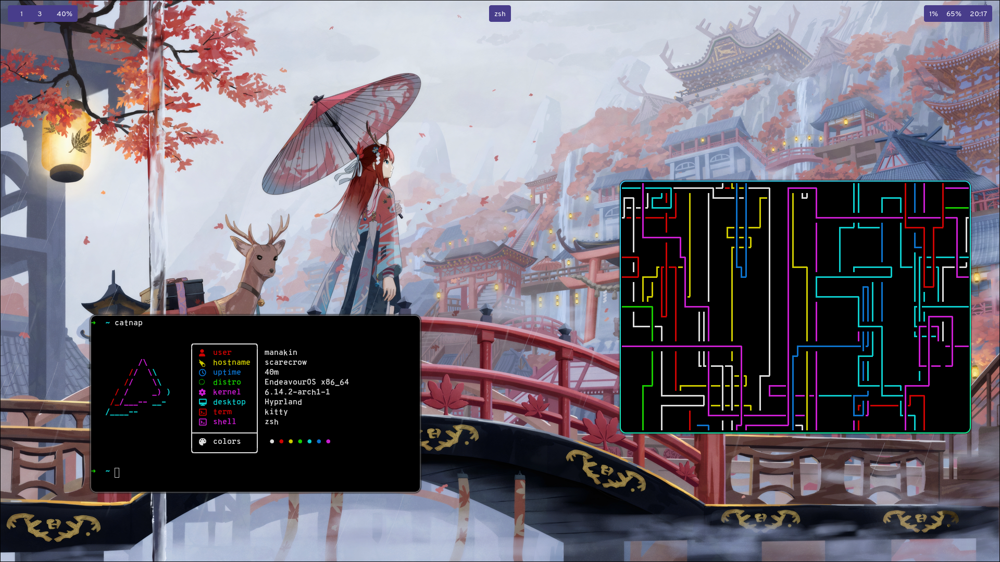
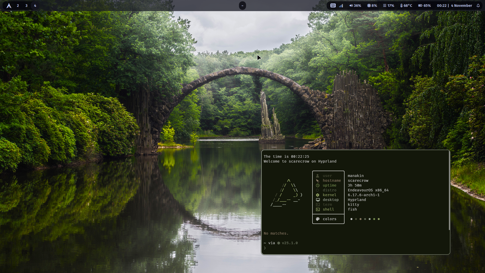
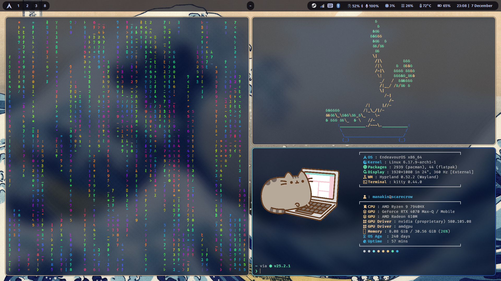

# dotfiles
Personalized hyprland dotfiles for my workspace.
Managed with [GNU Stow](https://www.gnu.org/software/stow/)


## System


| | |
|---|---|
| OS | EndeavourOS |
| WM | Hyprland |
| Terminal | kitty |
| Shell | fish + starship |
| Bar | waybar |
| Launcher | fuzzel |
| Lockscreen | hyprlock |
| Screenshots | hyprshot |
| Editor | nvim |
| Video | mpv |
| Image | swayimg |

## Setup
> Proceed at your own risk. Back up anything important before overwriting.

Clone this repository in your home folder and then link configs to `~/.config` 

```bash
stow -d ~/dotfiles/.config -t ~/.config .
```

`/home` provides additional configs meant to be stowed to `~`
```bash
stow -d ~/dotfiles/home -t ~ .
```

## Screenshots



